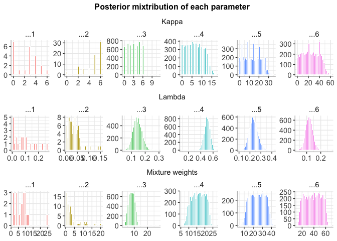

BayesMultiMode
================

An R package for testing the number of modes and their locations in
mixture distributions using Bayesian methods. The number of components
in the mixture is unknown a priori and estimated using Sparse Finite
Mixture (SFM) techniques in the MCMC algorithm.

### Installing the development version of BayesMultiMode

``` r
# install.packages("devtools") #if not on the machine already
# library(devtools)

# Installing from github
# devtools::install_github("paullabonne/BayesMultiMode")

# Loading the package
library(BayesMultiMode)
```

### Generating data

``` r
set.seed(1)
p1 = 0.3
p2 = 1-p1
kap1 = 3
kap2 = 0
lam1 = 1
lam2 = 0.5
length_data = 70
simulated_data <- c(rpois(length_data*p1, lam1)+kap1, rpois(length_data*p2, lam2)+kap2)
```

### Choosing either simulated or DNA data

``` r
# Select DNA data :
data("d4z4")
y = d4z4

# Or select simulated data :
# y = simulated_data
```

### Setting parameters for MCMC

``` r
# Number of MCMC iterations 
M = 5000 

# Proportion of draws to discard as burnin
S = 0.5 

# Maximum number of mixture components 
Jmax = 6
```

### Estimation with SFM MCMC

``` r
#Bayesian estimation
sfm_mcmc = sfm_mcmc_spmix(y=y,Jmax=Jmax, M=M)
```

    ## 10  % draws finished. Accept. prob of e0 = 9 percent
    ## 20  % draws finished. Accept. prob of e0 = 8 percent
    ## 30  % draws finished. Accept. prob of e0 = 8 percent
    ## 40  % draws finished. Accept. prob of e0 = 9 percent
    ## 50  % draws finished. Accept. prob of e0 = 9 percent
    ## 60  % draws finished. Accept. prob of e0 = 9 percent
    ## 70  % draws finished. Accept. prob of e0 = 9 percent
    ## 80  % draws finished. Accept. prob of e0 = 9 percent
    ## 90  % draws finished. Accept. prob of e0 = 9 percent
    ## 100  % draws finished. Accept. prob of e0 = 9 percent

``` r
#Plots of the estimation output
graphs = plots_mcmc(sfm_mcmc,S)
graphs[[3]]
```


``` r
graphs[[4]]
```



``` r
# Simple post-processing
post_sfmmcmc = post_sfm_mcmc(sfm_mcmc,S)
```

### Inference on modes

``` r
sfm_mcmc_modes = bayes_mode(post_sfmmcmc$theta_draws_slim,y)
sfm_mcmc_modes$graphs
```


