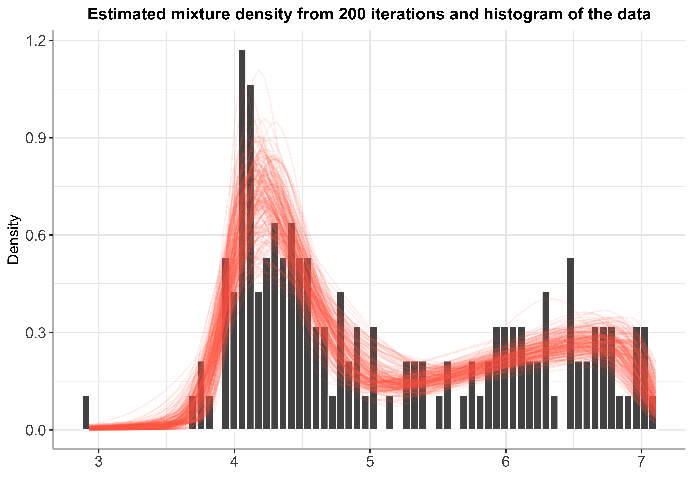
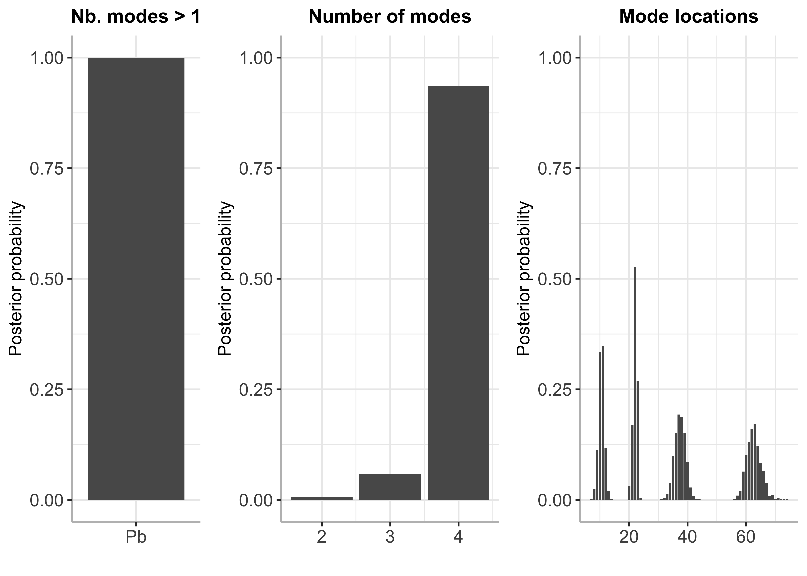
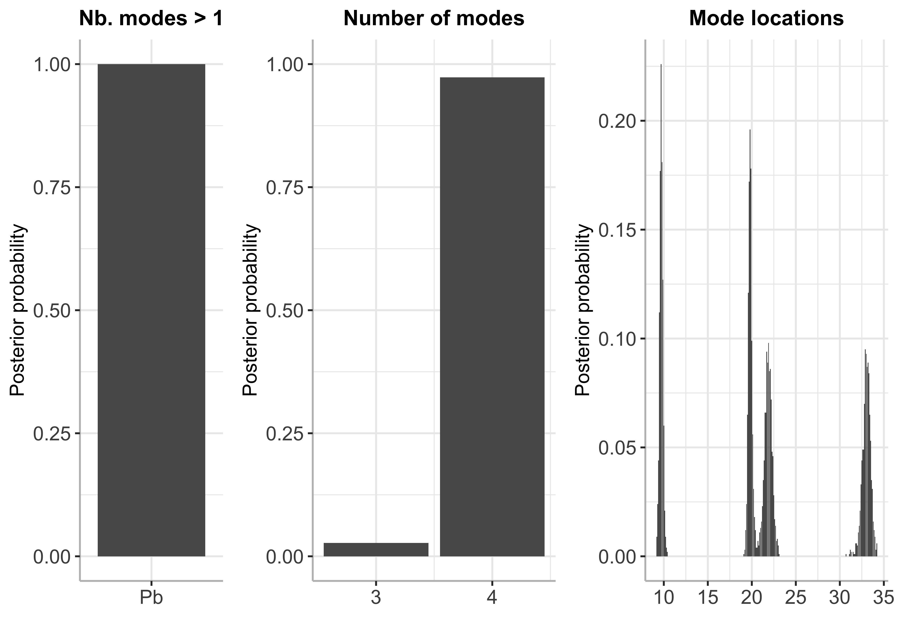

BayesMultiMode
================

<!-- badges: start -->

[](https://github.com/paullabonne/BayesMultiMode/actions/workflows/R-CMD-check.yaml)
[](https://cran.r-project.org/package=BayesMultiMode)
<!-- badges: end -->

An R package for detecting and exploring multimodality using Bayesian
techniques. The approach works in two stages. First, a mixture
distribution is fitted on the data. The number of mixture components
does not have to be specified; it can be estimated simultaneously with
the mixture weights and components through a Sparse Finite Mixture
approach. Second, the resulting MCMC draws are used to calculate the
number of modes and their locations. Posterior probabilities are
retrieved for both of these quantities providing a powerful tool for
mode inference.

### Installing BayesMultiMode from CRAN

``` r
install.packages("BayesMultiMode")
```

### Or installing the development version from GitHub

``` r
# install.packages("devtools") # if devtools is not installed 
devtools::install_github("paullabonne/BayesMultiMode")
```

### Loading BayesMultiMode

``` r
library(BayesMultiMode)
```

### Illustration with discrete data

#### Estimation

``` r
# retreive DNA data
y = d4z4

# estimation
bayesmix = bayes_estimation(data = y,
                            K = 5,
                            dist = "shifted_poisson",
                            nb_iter = 2000,
                            burnin = 1000)
```

    ## 10  % draws finished. Accept. prob of e0 = 12 percent
    ## 20  % draws finished. Accept. prob of e0 = 10 percent
    ## 30  % draws finished. Accept. prob of e0 = 12 percent
    ## 40  % draws finished. Accept. prob of e0 = 12 percent
    ## 50  % draws finished. Accept. prob of e0 = 10 percent
    ## 60  % draws finished. Accept. prob of e0 = 10 percent
    ## 70  % draws finished. Accept. prob of e0 = 10 percent
    ## 80  % draws finished. Accept. prob of e0 = 10 percent
    ## 90  % draws finished. Accept. prob of e0 = 10 percent
    ## 100  % draws finished. Accept. prob of e0 = 10 percent

``` r
# plot estimated mixture
plot(bayesmix, max_size = 200)
```

    ## Warning: Removed 41 rows containing missing values (`position_stack()`).

    ## Warning: Removed 86400 rows containing missing values (`geom_line()`).



#### Mode inference

``` r
# mode estimation
bayesmode = bayes_mode(bayesmix)

# plot 
plot(bayesmode, max_size = 200)
```



### Illustration with continuous data

#### Estimation

``` r
# retreive galaxy data
y = galaxy

# estimation
bayesmix = bayes_estimation(data = y,
                            K = 4,
                            dist = "normal",
                            nb_iter = 5000,
                            burnin = 2500,
                            chains = 1)
```

    ## 
    ## SAMPLING FOR MODEL 'normal_mixture' NOW (CHAIN 1).
    ## Chain 1: 
    ## Chain 1: Gradient evaluation took 4.2e-05 seconds
    ## Chain 1: 1000 transitions using 10 leapfrog steps per transition would take 0.42 seconds.
    ## Chain 1: Adjust your expectations accordingly!
    ## Chain 1: 
    ## Chain 1: 
    ## Chain 1: Iteration:    1 / 5000 [  0%]  (Warmup)
    ## Chain 1: Iteration: 1000 / 5000 [ 20%]  (Warmup)
    ## Chain 1: Iteration: 2000 / 5000 [ 40%]  (Warmup)
    ## Chain 1: Iteration: 2501 / 5000 [ 50%]  (Sampling)
    ## Chain 1: Iteration: 3500 / 5000 [ 70%]  (Sampling)
    ## Chain 1: Iteration: 4500 / 5000 [ 90%]  (Sampling)
    ## Chain 1: Iteration: 5000 / 5000 [100%]  (Sampling)
    ## Chain 1: 
    ## Chain 1:  Elapsed Time: 61.141 seconds (Warm-up)
    ## Chain 1:                62.284 seconds (Sampling)
    ## Chain 1:                123.425 seconds (Total)
    ## Chain 1:

    ## Warning: There were 143 divergent transitions after warmup. See
    ## https://mc-stan.org/misc/warnings.html#divergent-transitions-after-warmup
    ## to find out why this is a problem and how to eliminate them.

    ## Warning: There were 1993 transitions after warmup that exceeded the maximum treedepth. Increase max_treedepth above 10. See
    ## https://mc-stan.org/misc/warnings.html#maximum-treedepth-exceeded

    ## Warning: Examine the pairs() plot to diagnose sampling problems

    ## Warning: The largest R-hat is 1.09, indicating chains have not mixed.
    ## Running the chains for more iterations may help. See
    ## https://mc-stan.org/misc/warnings.html#r-hat

    ## Warning: Bulk Effective Samples Size (ESS) is too low, indicating posterior means and medians may be unreliable.
    ## Running the chains for more iterations may help. See
    ## https://mc-stan.org/misc/warnings.html#bulk-ess

    ## Warning: Tail Effective Samples Size (ESS) is too low, indicating posterior variances and tail quantiles may be unreliable.
    ## Running the chains for more iterations may help. See
    ## https://mc-stan.org/misc/warnings.html#tail-ess

``` r
bayesmix$fit
```

    ## Inference for Stan model: normal_mixture.
    ## 1 chains, each with iter=5000; warmup=2500; thin=1; 
    ## post-warmup draws per chain=2500, total post-warmup draws=2500.
    ## 
    ##             mean se_mean    sd    2.5%     25%     50%     75%   97.5% n_eff
    ## theta[1]    0.00    0.00  0.01    0.00    0.00    0.00    0.00    0.02   237
    ## theta[2]    0.08    0.00  0.03    0.03    0.06    0.08    0.10    0.14    67
    ## theta[3]    0.88    0.00  0.04    0.80    0.85    0.88    0.90    0.94    57
    ## theta[4]    0.04    0.00  0.02    0.00    0.02    0.04    0.05    0.09    32
    ## mu[1]    -145.60   14.72 97.74 -340.78 -214.73 -139.70  -62.03    2.51    44
    ## mu[2]       9.73    0.02  0.21    9.29    9.60    9.73    9.85   10.16   133
    ## mu[3]      21.37    0.03  0.23   20.91   21.21   21.37   21.52   21.81    78
    ## mu[4]      33.20    0.09  0.61   32.09   32.86   33.14   33.46   34.83    44
    ## sigma[1]    0.00    0.00  0.03    0.00    0.00    0.00    0.00    0.00  2332
    ## sigma[2]    0.54    0.03  0.15    0.33    0.42    0.51    0.62    0.88    28
    ## sigma[3]    2.18    0.02  0.17    1.87    2.07    2.18    2.27    2.52    89
    ## sigma[4]    1.00    0.15  0.70    0.49    0.71    0.83    1.01    3.44    23
    ## alpha[1]    0.23    0.01  0.07    0.12    0.18    0.22    0.27    0.41    37
    ## C0[1]       0.00    0.00  0.05    0.00    0.00    0.00    0.00    0.00  2497
    ## C0[2]       0.65    0.07  0.49    0.11    0.31    0.52    0.84    2.06    47
    ## C0[3]       3.03    0.22  1.82    0.61    1.62    2.66    4.06    7.62    70
    ## C0[4]       1.48    0.16  1.04    0.30    0.72    1.17    1.97    4.14    45
    ## lp__     -239.39    0.68  3.64 -248.50 -241.26 -238.82 -236.71 -234.18    29
    ##          Rhat
    ## theta[1] 1.02
    ## theta[2] 1.05
    ## theta[3] 1.02
    ## theta[4] 1.00
    ## mu[1]    1.00
    ## mu[2]    1.02
    ## mu[3]    1.02
    ## mu[4]    1.03
    ## sigma[1] 1.00
    ## sigma[2] 1.01
    ## sigma[3] 1.01
    ## sigma[4] 1.07
    ## alpha[1] 1.07
    ## C0[1]    1.00
    ## C0[2]    1.00
    ## C0[3]    1.01
    ## C0[4]    1.02
    ## lp__     1.10
    ## 
    ## Samples were drawn using NUTS(diag_e) at Mon Jan 16 16:14:29 2023.
    ## For each parameter, n_eff is a crude measure of effective sample size,
    ## and Rhat is the potential scale reduction factor on split chains (at 
    ## convergence, Rhat=1).

``` r
# plot estimated mixture
plot(bayesmix, max_size = 200)
```

    ## Warning: The dot-dot notation (`..density..`) was deprecated in ggplot2 3.4.0.
    ## ℹ Please use `after_stat(density)` instead.
    ## ℹ The deprecated feature was likely used in the BayesMultiMode package.
    ##   Please report the issue at
    ##   <]8;;https://github.com/paullabonne/BayesMultiMode/issueshttps://github.com/paullabonne/BayesMultiMode/issues]8;;>.


#### Mode inference

``` r
# Mode Estimation
bayesmode = bayes_mode(bayesmix)

# Plot 
plot(bayesmode, max_size = 200)
```



### References


<div id="refs" class="references csl-bib-body hanging-indent">

<div id="ref-basturk_bayes_2021" class="csl-entry">

Basturk, Nalan, Lennart F. Hoogerheide, and Herman van Dijk. 2021.
“Bayes Estimates of Multimodal Density Features Using DNA and Economic
Data.” *SSRN Electronic Journal*.
<https://doi.org/10.2139/ssrn.3783351>.

</div>

<div id="ref-malsiner-walli_model-based_2016" class="csl-entry">

Malsiner-Walli, Gertraud, Sylvia Fruhwirth-Schnatter, and Bettina Grun.
2016. “Model-Based Clustering Based on Sparse Finite Gaussian Mixtures.”
*Statistics and Computing* 26 (1): 303–24.
<https://doi.org/10.1007/s11222-014-9500-2>.

</div>

<div id="ref-schaap_genome-wide_2013" class="csl-entry">

Schaap, Mireille, Richard JLF Lemmers, Roel Maassen, Patrick J. van der
Vliet, Lennart F. Hoogerheide, Herman K. van Dijk, Nalan Basturk, Peter
de Knijff, and Silvère M. van der Maarel. 2013. “Genome-Wide Analysis of
Macrosatellite Repeat Copy Number Variation in Worldwide Populations:
Evidence for Differences and Commonalities in Size Distributions and
Size Restrictions.” *BMC Genomics* 14 (1): 143.
<https://doi.org/10.1186/1471-2164-14-143>.

</div>

</div>
