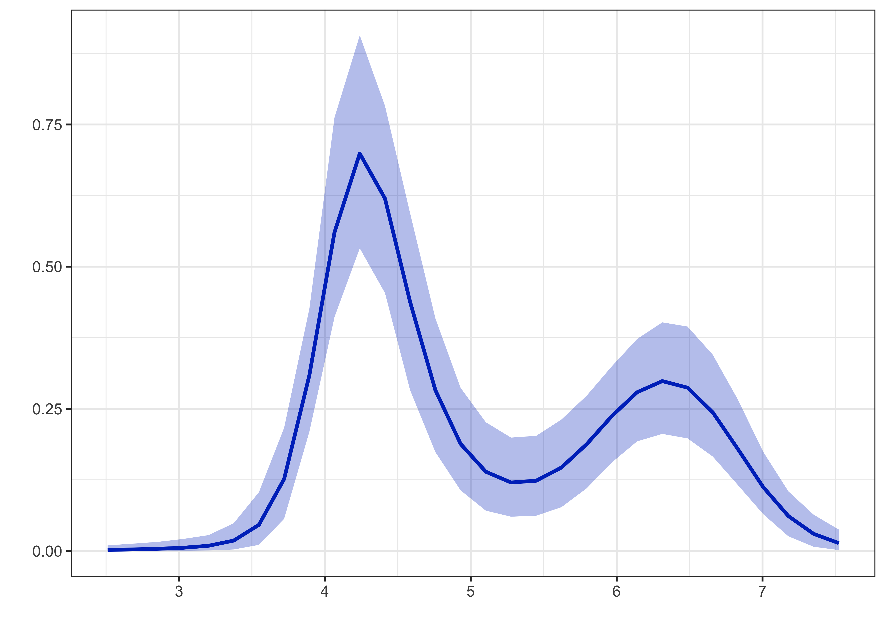
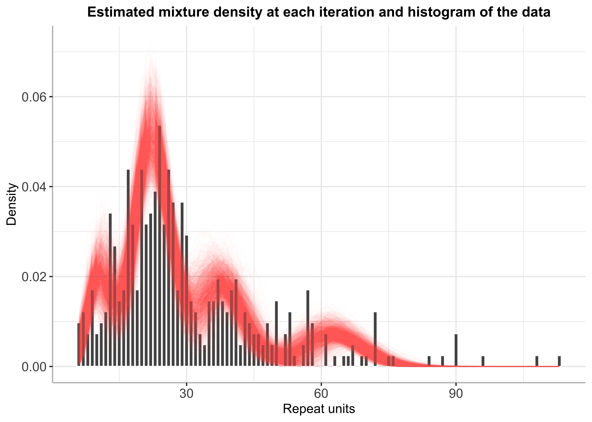
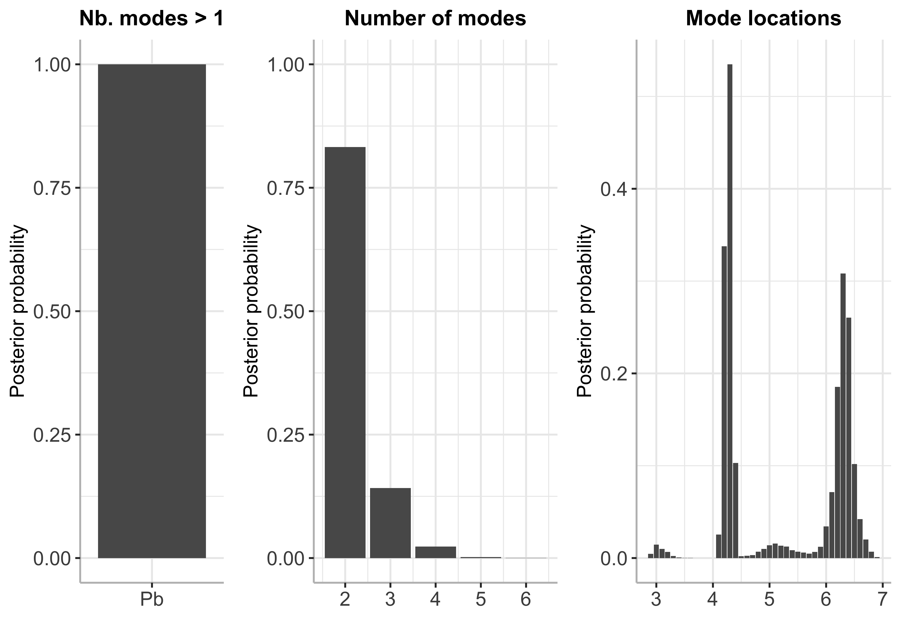

BayesMultiMode
================

<!-- badges: start -->

[](https://github.com/paullabonne/BayesMultiMode/actions/workflows/R-CMD-check.yaml)
<!-- badges: end -->

An R package for detecting multimodality in discrete data using Bayesian
techniques. The approach works in two stages. First, a mixture
distribution is fitted on the data using a Sparse Finite Mixture (SFM)
MCMC algorithm. The number of mixture components does not have to be
specified; it is estimated simultaneously with the mixture weights and
components through the SFM approach. Second, the resulting MCMC output
is used to calculate the number of modes and their locations. Posterior
probabilities are retrieved for both of these quantities providing a
powerful tool for mode inference. Currently the package supports a
flexible mixture of shifted Poisson distributions. The shifted Poisson
is a two-parameter generalisation of the Poisson distribution where the
mean can diverge from the variance. More distributions (discrete and
continuous) are in the pipeline.

### Installing BayesMultiMode

``` r
# Installing from github :
# install.packages("devtools") # if devtools is not installed 
devtools::install_github("paullabonne/BayesMultiMode")
```

### Loading the package

``` r
library(BayesMultiMode)
```

### Generating data

``` r
set.seed(1)
p1 = 0.3
p2 = 1-p1
kap1 = 3
kap2 = 0
lam1 = 1
lam2 = 0.5
length_data = 70
simulated_data <- c(rpois(length_data*p1, lam1)+kap1, rpois(length_data*p2, lam2)+kap2)
```

### Choosing either simulated or DNA data

``` r
# Select DNA data :
data("d4z4")
y = d4z4

# Or select simulated data :
# y = simulated_data
```

### Setting parameters for SFM MCMC estimation

``` r
# Number of MCMC iterations 
M = 5000 

# Proportion of draws to discard as burnin
S = 0.5 

# Maximum number of mixture components 
Jmax = 6
```

### Estimation with SFM MCMC

``` r
#Bayesian estimation
sfm_mcmc = sfm_mcmc_spmix(y=y,Jmax=Jmax, M=M)
```

    ## 10  % draws finished. Accept. prob of e0 = 9 percent
    ## 20  % draws finished. Accept. prob of e0 = 8 percent
    ## 30  % draws finished. Accept. prob of e0 = 8 percent
    ## 40  % draws finished. Accept. prob of e0 = 9 percent
    ## 50  % draws finished. Accept. prob of e0 = 9 percent
    ## 60  % draws finished. Accept. prob of e0 = 9 percent
    ## 70  % draws finished. Accept. prob of e0 = 9 percent
    ## 80  % draws finished. Accept. prob of e0 = 9 percent
    ## 90  % draws finished. Accept. prob of e0 = 9 percent
    ## 100  % draws finished. Accept. prob of e0 = 9 percent

``` r
#Plots of the estimation output
graphs = plots_mcmc(sfm_mcmc,S)
graphs[[3]]
```



``` r
graphs[[4]]
```

    ## Warning: Removed 41 rows containing missing values (position_stack).



### Post-processing : burn-in and discarding empty components

``` r
post_sfmmcmc = post_sfm_mcmc(sfm_mcmc,S)
```

### Mode inference

``` r
sfm_mcmc_modes = bayes_mode(post_sfmmcmc$theta_draws_slim,y)
sfm_mcmc_modes$graphs
```



### References

(Basturk, Hoogerheide, and Dijk 2021) (Malsiner-Walli,
Fruhwirth-Schnatter, and Grun 2016) (Schaap et al. 2013)

<div id="refs" class="references csl-bib-body hanging-indent">

<div id="ref-basturk_bayes_2021" class="csl-entry">

Basturk, Nalan, Lennart F. Hoogerheide, and Herman van Dijk. 2021.
“Bayes Estimates of Multimodal Density Features Using DNA and Economic
Data.” *SSRN Electronic Journal*.
<https://doi.org/10.2139/ssrn.3783351>.

</div>

<div id="ref-malsiner-walli_model-based_2016" class="csl-entry">

Malsiner-Walli, Gertraud, Sylvia Fruhwirth-Schnatter, and Bettina Grun.
2016. “Model-Based Clustering Based on Sparse Finite Gaussian Mixtures.”
*Statistics and Computing* 26 (1): 303–24.
<https://doi.org/10.1007/s11222-014-9500-2>.

</div>

<div id="ref-schaap_genome-wide_2013" class="csl-entry">

Schaap, Mireille, Richard JLF Lemmers, Roel Maassen, Patrick J. van der
Vliet, Lennart F. Hoogerheide, Herman K. van Dijk, Nalan Basturk, Peter
de Knijff, and Silvère M. van der Maarel. 2013. “Genome-Wide Analysis of
Macrosatellite Repeat Copy Number Variation in Worldwide Populations:
Evidence for Differences and Commonalities in Size Distributions and
Size Restrictions.” *BMC Genomics* 14 (1): 143.
<https://doi.org/10.1186/1471-2164-14-143>.

</div>

</div>
