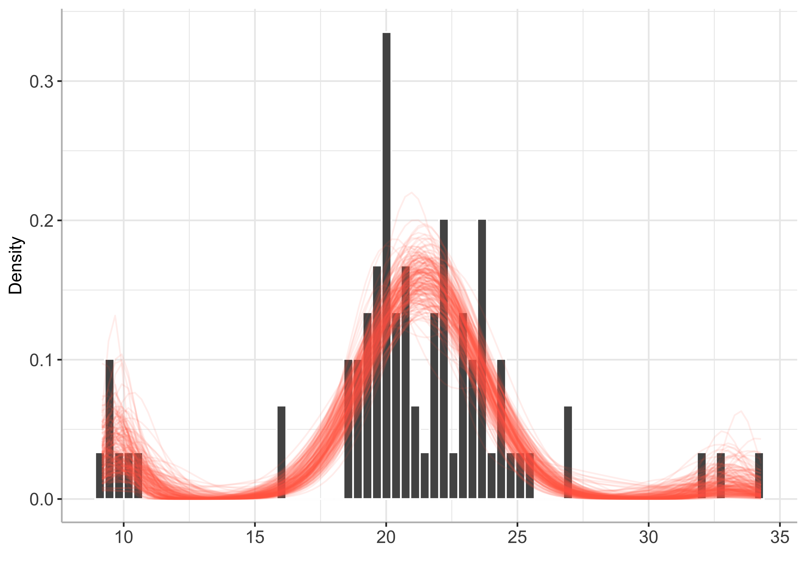

BayesMultiMode
================

<!-- badges: start -->

[](https://github.com/paullabonne/BayesMultiMode/actions/workflows/R-CMD-check.yaml)
[](https://cran.r-project.org/package=BayesMultiMode)
<!-- badges: end -->

An R package for detecting and exploring multimodality using Bayesian
techniques. The approach works in two stages. First, a mixture
distribution is fitted on the data. The number of mixture components
does not have to be specified; it can be estimated simultaneously with
the mixture weights and components through a Sparse Finite Mixture
approach. Second, the resulting MCMC draws are used to calculate the
number of modes and their locations. Posterior probabilities are
retrieved for both of these quantities providing a powerful tool for
mode inference.

### Installing BayesMultiMode from CRAN

``` r
install.packages("BayesMultiMode")
```

### Or installing the development version from GitHub

``` r
# install.packages("devtools") # if devtools is not installed 
devtools::install_github("paullabonne/BayesMultiMode")
```

### Loading BayesMultiMode

``` r
library(BayesMultiMode)
```

### Illustration with discrete data

#### Estimation

``` r
# retreive DNA data
y = d4z4

# estimation
bayesmix = bayes_estimation(data = y,
                            K = 5,
                            dist = "shifted_poisson",
                            nb_iter = 2000,
                            burnin = 1000)
```

    ## 10  % draws finished. Accept. prob of e0 = 14 percent
    ## 20  % draws finished. Accept. prob of e0 = 15 percent
    ## 30  % draws finished. Accept. prob of e0 = 14 percent
    ## 40  % draws finished. Accept. prob of e0 = 13 percent
    ## 50  % draws finished. Accept. prob of e0 = 13 percent
    ## 60  % draws finished. Accept. prob of e0 = 13 percent
    ## 70  % draws finished. Accept. prob of e0 = 13 percent
    ## 80  % draws finished. Accept. prob of e0 = 12 percent
    ## 90  % draws finished. Accept. prob of e0 = 12 percent
    ## 100  % draws finished. Accept. prob of e0 = 12 percent

``` r
# plot estimated mixture
plot(bayesmix, max_size = 200)
```

    ## Warning: Removed 41 rows containing missing values (`position_stack()`).

    ## Warning: Removed 86400 rows containing missing values (`geom_line()`).



#### Mode inference

``` r
# mode estimation
bayesmode = bayes_mode(bayesmix)

# plot 
plot(bayesmode, max_size = 200)
```


### Illustration with continuous data

#### Estimation

``` r
# retreive galaxy data
y = galaxy

# estimation
bayesmix = bayes_estimation(data = y,
                            K = 4,
                            dist = "normal",
                            nb_iter = 2000,
                            burnin = 1000,
                            chains = 1,
                            G0 = 0)
```

    ## 
    ## SAMPLING FOR MODEL 'normal_mixture' NOW (CHAIN 1).
    ## Chain 1: 
    ## Chain 1: Gradient evaluation took 5.4e-05 seconds
    ## Chain 1: 1000 transitions using 10 leapfrog steps per transition would take 0.54 seconds.
    ## Chain 1: Adjust your expectations accordingly!
    ## Chain 1: 
    ## Chain 1: 
    ## Chain 1: Iteration:    1 / 2000 [  0%]  (Warmup)
    ## Chain 1: Iteration: 1000 / 2000 [ 50%]  (Warmup)
    ## Chain 1: Iteration: 1001 / 2000 [ 50%]  (Sampling)
    ## Chain 1: Iteration: 2000 / 2000 [100%]  (Sampling)
    ## Chain 1: 
    ## Chain 1:  Elapsed Time: 2.491 seconds (Warm-up)
    ## Chain 1:                0.698 seconds (Sampling)
    ## Chain 1:                3.189 seconds (Total)
    ## Chain 1:

    ## Warning: There were 1 divergent transitions after warmup. See
    ## https://mc-stan.org/misc/warnings.html#divergent-transitions-after-warmup
    ## to find out why this is a problem and how to eliminate them.

    ## Warning: Examine the pairs() plot to diagnose sampling problems

    ## Warning: Bulk Effective Samples Size (ESS) is too low, indicating posterior means and medians may be unreliable.
    ## Running the chains for more iterations may help. See
    ## https://mc-stan.org/misc/warnings.html#bulk-ess

    ## Warning: Tail Effective Samples Size (ESS) is too low, indicating posterior variances and tail quantiles may be unreliable.
    ## Running the chains for more iterations may help. See
    ## https://mc-stan.org/misc/warnings.html#tail-ess

``` r
# plot estimated mixture
plot(bayesmix, max_size = 200)
```

    ## Warning: The dot-dot notation (`..density..`) was deprecated in ggplot2 3.4.0.
    ## ℹ Please use `after_stat(density)` instead.
    ## ℹ The deprecated feature was likely used in the BayesMultiMode package.
    ##   Please report the issue at
    ##   <]8;;https://github.com/paullabonne/BayesMultiMode/issueshttps://github.com/paullabonne/BayesMultiMode/issues]8;;>.


#### Mode inference

``` r
# Mode Estimation
bayesmode = bayes_mode(bayesmix)

# Plot 
plot(bayesmode, max_size = 200)
```


### References

<div id="refs" class="references csl-bib-body hanging-indent">

<div id="ref-basturk_bayes_2021" class="csl-entry">

Basturk, Nalan, Lennart F. Hoogerheide, and Herman van Dijk. 2021.
“Bayes Estimates of Multimodal Density Features Using DNA and Economic
Data.” *SSRN Electronic Journal*.
<https://doi.org/10.2139/ssrn.3783351>.

</div>

<div id="ref-malsiner-walli_model-based_2016" class="csl-entry">

Malsiner-Walli, Gertraud, Sylvia Fruhwirth-Schnatter, and Bettina Grun.
2016. “Model-Based Clustering Based on Sparse Finite Gaussian Mixtures.”
*Statistics and Computing* 26 (1): 303–24.
<https://doi.org/10.1007/s11222-014-9500-2>.

</div>

<div id="ref-schaap_genome-wide_2013" class="csl-entry">

Schaap, Mireille, Richard JLF Lemmers, Roel Maassen, Patrick J. van der
Vliet, Lennart F. Hoogerheide, Herman K. van Dijk, Nalan Basturk, Peter
de Knijff, and Silvère M. van der Maarel. 2013. “Genome-Wide Analysis of
Macrosatellite Repeat Copy Number Variation in Worldwide Populations:
Evidence for Differences and Commonalities in Size Distributions and
Size Restrictions.” *BMC Genomics* 14 (1): 143.
<https://doi.org/10.1186/1471-2164-14-143>.

</div>

</div>
