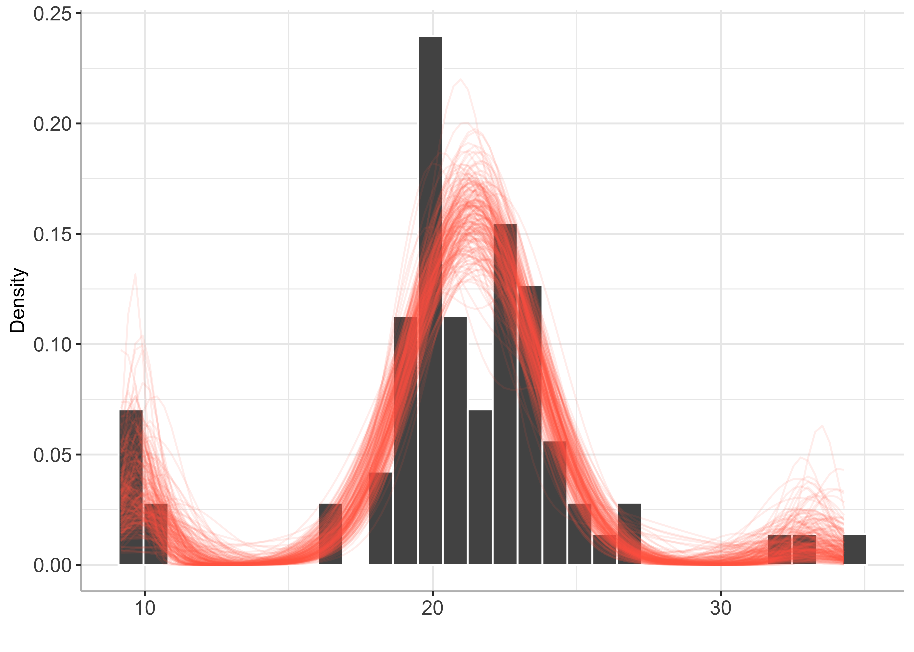
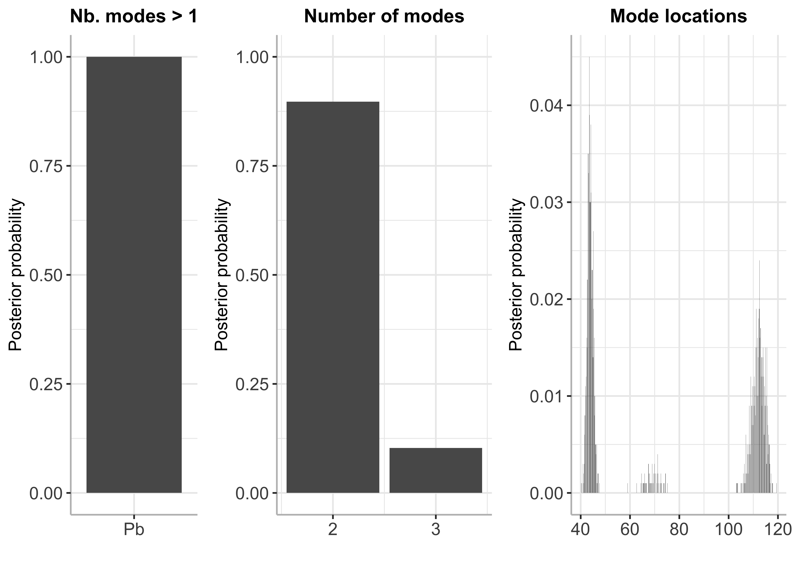

BayesMultiMode
================

<!-- badges: start -->

[](https://github.com/paullabonne/BayesMultiMode/actions/workflows/R-CMD-check.yaml)
[](https://cran.r-project.org/package=BayesMultiMode)
<!-- badges: end -->

`BayesMultiMode` is an R package for detecting and exploring
multimodality using Bayesian techniques. The approach works in two
stages. First, a mixture distribution is fitted on the data using a
sparse finite mixture Markov chain Monte Carlo (SFM MCMC) algorithm. The
number of mixture components does not have to be known; the size of the
mixture is estimated endogenously through the SFM approach. Second, the
modes of the estimated mixture in each MCMC draw are retrieved using
algorithms specifically tailored for mode detection. These estimates are
then used to construct posterior probabilities for the number of modes,
their locations and uncertainties, providing a powerful tool for mode
inference. See Basturk et al. (2023) and Cross et al. (2023) for more
details.

### Installing BayesMultiMode from CRAN

``` r
install.packages("BayesMultiMode")
```

### Or installing the development version from GitHub

``` r
# install.packages("devtools") # if devtools is not installed 
devtools::install_github("paullabonne/BayesMultiMode")
```

### Loading BayesMultiMode

``` r
library(BayesMultiMode)
```

### Using BayesMultiMode for both MCMC estimation and mode inference

`BayesMultiMode` provides a very flexible and efficient MCMC estimation
approach : it handles mixtures with unknown number of components through
the sparse finite mixture approach of Malsiner-Walli,
Fruhwirth-Schnatter, and Grun (2016) and supports a comprehensive range
of mixture distributions, both continuous and discrete.

#### Estimation

``` r
set.seed(123)

# retrieve galaxy data
y = galaxy

# estimation
bayesmix = bayes_estimation(data = y,
                            K = 10,
                            dist = "normal",
                            nb_iter = 2000,
                            burnin = 1000)
```

    ## 10  % draws finished
    ## 20  % draws finished
    ## 30  % draws finished
    ## 40  % draws finished
    ## 50  % draws finished
    ## 60  % draws finished
    ## 70  % draws finished
    ## 80  % draws finished
    ## 90  % draws finished
    ## 100  % draws finished

``` r
# plot estimated mixture
plot(bayesmix, max_size = 200)
```



#### Mode inference

``` r
# mode estimation
bayesmode = bayes_mode(bayesmix)

# plot 
plot(bayesmode, max_size = 200)
```


``` r
# Summary 
summary(bayesmode)
```

    ## The posterior probability of the data being multimodal is 0.993
    ## 
    ##  Number of estimated modes and their posterior probabilities:

    ##      Number of modes Posterior probabilty
    ## [1,]               1                0.007
    ## [2,]               2                0.133
    ## [3,]               3                0.840
    ## [4,]               4                0.020

### Using BayesMultiMode for mode inference with external MCMC output

`BayesMultiMode` also works on MCMC output generated using external
software. The function `new_BayesMixture()` creates an object of class
`BayesMixture` which can then be used as input in the mode inference
function `bayes_mode()`. Here is an example using cyclone intensity data
(Knapp et al. 2018) and the `BNPmix` package for estimation.

``` r
library(BNPmix)
library(dplyr)

y = cyclone %>%
  filter(BASIN == "SI",
         SEASON > "1981") %>%
  select(max_wind) %>%
  unlist()

## estimation
PY_result = PYdensity(y,
                      mcmc = list(niter = 2000, nburn = 1000),
                      output = list(out_param = TRUE))
```

    ## Completed:   200/2000 - in 0.044977 sec
    ## Completed:   400/2000 - in 0.095208 sec
    ## Completed:   600/2000 - in 0.156805 sec
    ## Completed:   800/2000 - in 0.210785 sec
    ## Completed:   1000/2000 - in 0.262655 sec
    ## Completed:   1200/2000 - in 0.316738 sec
    ## Completed:   1400/2000 - in 0.372312 sec
    ## Completed:   1600/2000 - in 0.427642 sec
    ## Completed:   1800/2000 - in 0.485542 sec
    ## Completed:   2000/2000 - in 0.542392 sec
    ## 
    ## Estimation done in 0.542409 seconds

#### Transforming the output into a mcmc matrix with one column per variable

``` r
library(dplyr)

mcmc_py = list()

for (i in 1:length(PY_result$p)) {
  k = length(PY_result$p[[i]][, 1])
  
  draw = c(PY_result$p[[i]][, 1],
           PY_result$mean[[i]][, 1],
           sqrt(PY_result$sigma2[[i]][, 1]),
           i)
  
  names(draw)[1:k] = paste0("eta", 1:k)
  names(draw)[(k+1):(2*k)] = paste0("mu", 1:k)
  names(draw)[(2*k+1):(3*k)] = paste0("sigma", 1:k)
  names(draw)[3*k + 1] = "draw"
  
  mcmc_py[[i]] = draw
}

mcmc_py = bind_rows(mcmc_py)
```

#### Creating an object of class `BayesMixture`

``` r
pars_names = c(eta = "eta",
               mu = "mu",
               sigma = "sigma")

py_BayesMix = new_BayesMixture(mcmc = mcmc_py,
                               data = y,
                               K = (ncol(mcmc_py)-1)/3,
                               burnin = 0, # the burnin has already been discarded
                               dist = "normal",
                               pars_names = pars_names,
                               dist_type = "continuous")
```

#### Plotting the mixture

``` r
plot(py_BayesMix)
```

    ## `stat_bin()` using `bins = 30`. Pick better value with `binwidth`.


#### Mode inference

``` r
# mode estimation
bayesmode = bayes_mode(py_BayesMix)

# plot ¨
plot(bayesmode, max_size = 200)
```



``` r
# Summary 
summary(bayesmode)
```

    ## The posterior probability of the data being multimodal is 1
    ## 
    ##  Number of estimated modes and their posterior probabilities:

    ##      Number of modes Posterior probabilty
    ## [1,]               2                0.897
    ## [2,]               3                0.103

### References

<div id="refs" class="references csl-bib-body hanging-indent">

<div id="ref-basturk_2023" class="csl-entry">

Basturk, Nalan, Jamie L. Cross, Peter de Knijff, Lennart Hoogerheide,
Paul Labonne, and Herman K. van Dijk. 2023. “BayesMultiMode: Bayesian
Mode Inference in r.” *Tinbergen Institute Discussion Paper TI
2023-041/III*.

</div>

<div id="ref-cross_2023" class="csl-entry">

Cross, Jamie L., Lennart Hoogerheide, Paul Labonne, and Herman K. van
Dijk. 2023. “Credible Mode Determination in Multimodal Economic and
Financial Data Distributions.” *Tinbergen Institute Discussion Paper TI
2023-038/III*.

</div>

<div id="ref-knapp_international_2018" class="csl-entry">

Knapp, Kenneth R., Howard J. Diamond, Kossin J. P., Michael C. Kruk, and
C. J. Schreck. 2018. “International Best Track Archive for Climate
Stewardship (IBTrACS) Project, Version 4.” *NOAA National Centers for
Environmental Information*. <https://doi.org/10.1175/2009BAMS2755.1>.

</div>

<div id="ref-malsiner-walli_model-based_2016" class="csl-entry">

Malsiner-Walli, Gertraud, Sylvia Fruhwirth-Schnatter, and Bettina Grun.
2016. “Model-Based Clustering Based on Sparse Finite Gaussian Mixtures.”
*Statistics and Computing* 26 (1): 303–24.
<https://doi.org/10.1007/s11222-014-9500-2>.

</div>

</div>
