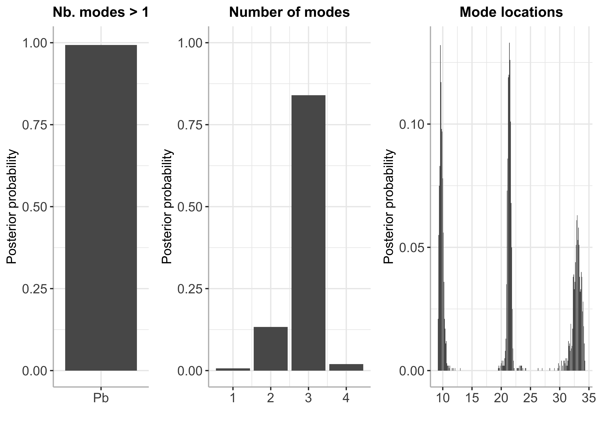
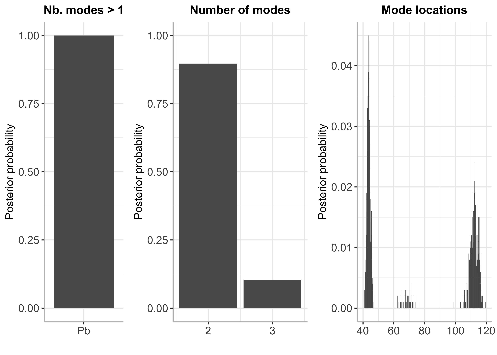

BayesMultiMode
================

<!-- badges: start -->

[](https://github.com/paullabonne/BayesMultiMode/actions/workflows/R-CMD-check.yaml)
[](https://cran.r-project.org/package=BayesMultiMode)
<!-- badges: end -->

`BayesMultiMode` is an R package for detecting and exploring
multimodality using Bayesian techniques. The approach works in two
stages. First, a mixture distribution is fitted on the data. The number
of mixture components does not have to be specified; the size of the
mixture is estimated simultaneously with the mixture weights and
components through a Sparse Finite Mixture approach. Second, the
resulting MCMC draws are used to calculate the number of modes and their
locations. Posterior probabilities are retrieved for both of these
quantities providing a powerful tool for mode inference.

### Installing BayesMultiMode from CRAN

``` r
install.packages("BayesMultiMode")
```

### Or installing the development version from GitHub

``` r
# install.packages("devtools") # if devtools is not installed 
devtools::install_github("paullabonne/BayesMultiMode")
```

### Loading BayesMultiMode

``` r
library(BayesMultiMode)
```

### Using BayesMultiMode for both MCMC estimation and mode inference

`BayesMultiMode` provides a very flexible and efficient MCMC estimation
approach : it handles mixtures with unknown number of components and
supports a comprehensive range of mixture distributions, both continuous
and discrete.

#### Estimation

``` r
# retrieve acidity data
y = acidity

# estimation
bayesmix = bayes_estimation(data = y,
                            K = 5,
                            dist = "skew_normal",
                            nb_iter = 2000,
                            burnin = 1000)
```

    ## 10  % draws finished
    ## 20  % draws finished
    ## 30  % draws finished
    ## 40  % draws finished
    ## 50  % draws finished
    ## 60  % draws finished
    ## 70  % draws finished
    ## 80  % draws finished
    ## 90  % draws finished
    ## 100  % draws finished

``` r
# plot estimated mixture
plot(bayesmix, max_size = 200)
```


#### Mode inference

``` r
# mode estimation
bayesmode = bayes_mode(bayesmix, show_plot = F)

# plot 
plot(bayesmode, max_size = 200)
```



``` r
# Summary 
summary(bayesmode)
```

    ## The posterior probability of the data being multimodal is 1 .
    ## 
    ## The number of estimated modes and their posterior probabilities is:

    ##      Number of modes Posterior probabilty
    ## [1,]               2                0.977
    ## [2,]               3                0.023

### Using BayesMultiMode for mode inference with external MCMC output

`BayesMultiMode` also works on MCMC output generated using external
software. The function `new_BayesMixture()` creates an object of class
`BayesMixture` which can then be used as input in the mode inference
function of `bayes_mode()`. Here is an example where the `BNPmix`
package is used for MCMC estimation.

``` r
library(BNPmix)

y = acidity

## estimation
PY_result = PYdensity(y,
                     mcmc = list(niter = 10000, nburn = 5000),
                     output = list(out_param = TRUE))
```

    ## Completed:   1000/10000 - in 0.093852 sec
    ## Completed:   2000/10000 - in 0.184289 sec
    ## Completed:   3000/10000 - in 0.274799 sec
    ## Completed:   4000/10000 - in 0.360535 sec
    ## Completed:   5000/10000 - in 0.45362 sec
    ## Completed:   6000/10000 - in 0.54145 sec
    ## Completed:   7000/10000 - in 0.634023 sec
    ## Completed:   8000/10000 - in 0.722045 sec
    ## Completed:   9000/10000 - in 0.807763 sec
    ## Completed:   10000/10000 - in 0.894157 sec
    ## 
    ## Estimation done in 0.894165 seconds

``` r
plot(PY_result)
```


#### Transforming the output into a mcmc matrix with one column per variable

``` r
library(dplyr)

mcmc_py = list()

for (i in 1:length(PY_result$p)) {
  k = length(PY_result$p[[i]][, 1])
  
  draw = c(PY_result$p[[i]][, 1],
           PY_result$mean[[i]][, 1],
           sqrt(PY_result$sigma2[[i]][, 1]),
           i)
  
  names(draw)[1:k] = paste0("theta", 1:k)
  names(draw)[(k+1):(2*k)] = paste0("mu", 1:k)
  names(draw)[(2*k+1):(3*k)] = paste0("sigma", 1:k)
  names(draw)[3*k + 1] = "draw"
  
  mcmc_py[[i]] = draw
}

mcmc_py = bind_rows(mcmc_py)
```

#### Creating an object of class `BayesMixture`

``` r
pars_names = c(theta = "theta",
               mu = "mu",
               sigma = "sigma")

py_BayesMix = new_BayesMixture(mcmc = mcmc_py,
                               data = y,
                               K = (ncol(mcmc_py)-1)/3,
                               burnin = 0, # the burnin has already been discarded
                               dist = "normal",
                               pars_names = pars_names,
                               dist_type = "continuous")
```

#### Mode inference

``` r
# mode estimation
bayesmode = bayes_mode(py_BayesMix)

# plot 
plot(bayesmode, max_size = 200)
```



``` r
# Summary 
summary(bayesmode)
```

    ## The posterior probability of the data being multimodal is 1 .
    ## 
    ## The number of estimated modes and their posterior probabilities is:

    ##      Number of modes Posterior probabilty
    ## [1,]               2               0.8246
    ## [2,]               3               0.1576
    ## [3,]               4               0.0166
    ## [4,]               5               0.0012

### References

(Basturk, Hoogerheide, and Dijk 2021) (Malsiner-Walli,
Fruhwirth-Schnatter, and Grun 2016) (Schaap et al. 2013)

<div id="refs" class="references csl-bib-body hanging-indent">

<div id="ref-basturk_bayes_2021" class="csl-entry">

Basturk, Nalan, Lennart F. Hoogerheide, and Herman van Dijk. 2021.
“Bayes Estimates of Multimodal Density Features Using DNA and Economic
Data.” *SSRN Electronic Journal*.
<https://doi.org/10.2139/ssrn.3783351>.

</div>

<div id="ref-malsiner-walli_model-based_2016" class="csl-entry">

Malsiner-Walli, Gertraud, Sylvia Fruhwirth-Schnatter, and Bettina Grun.
2016. “Model-Based Clustering Based on Sparse Finite Gaussian Mixtures.”
*Statistics and Computing* 26 (1): 303–24.
<https://doi.org/10.1007/s11222-014-9500-2>.

</div>

<div id="ref-schaap_genome-wide_2013" class="csl-entry">

Schaap, Mireille, Richard JLF Lemmers, Roel Maassen, Patrick J. van der
Vliet, Lennart F. Hoogerheide, Herman K. van Dijk, Nalan Basturk, Peter
de Knijff, and Silvère M. van der Maarel. 2013. “Genome-Wide Analysis of
Macrosatellite Repeat Copy Number Variation in Worldwide Populations:
Evidence for Differences and Commonalities in Size Distributions and
Size Restrictions.” *BMC Genomics* 14 (1): 143.
<https://doi.org/10.1186/1471-2164-14-143>.

</div>

</div>
