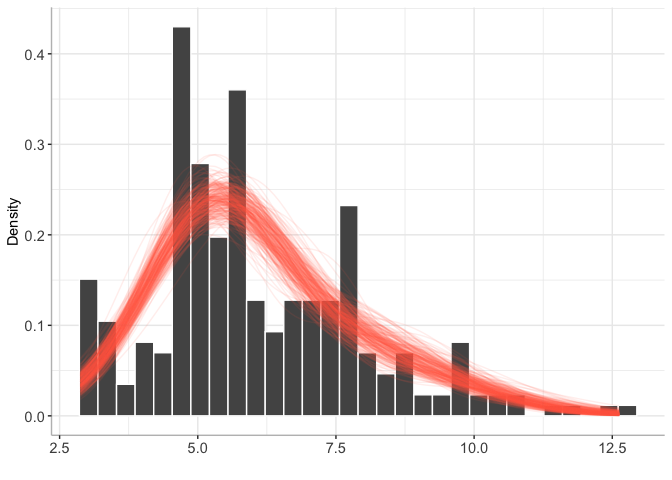

Compatibility with other R packages
================

``` r
library(BayesMultiMode)
library(posterior)
```

    ## This is posterior version 1.5.0

    ## 
    ## Attaching package: 'posterior'

    ## The following objects are masked from 'package:stats':
    ## 
    ##     mad, sd, var

    ## The following objects are masked from 'package:base':
    ## 
    ##     %in%, match

## Bayesian estimation and mode inference

In the examples presented below external R packages are used for
Bayesian estimation of mixture models while `BayesMultiMode` is used for
mode inference.

### rjags

#### Estimation

``` r
set.seed(123)

library(rjags)
```

    ## Loading required package: coda

    ## Linked to JAGS 4.3.1

    ## Loaded modules: basemod,bugs

``` r
# Assuming you have your data in 'data_vector'
# Specify the model
model_string = "
  model {
    for (i in 1:N) {
      data_vector[i] ~ dnorm(mu[component[i]], tau[component[i]])
      component[i] ~ dcat(theta[])
    }

    for (j in 1:K) {
      mu[j] ~ dnorm(0, 0.01)
      tau[j] ~ dgamma(1, 1)
    }

    theta ~ ddirch(rep(1, K))
  }
"

K = 2
# Data for JAGS
y = c(rnorm(100,0,1),
      rnorm(100,5,1))

data_jags = list(data_vector = y, N = length(y), K = K)

# Initialize parameters
inits = function() {
  list(mu = rnorm(K, 0, 10),
       tau = rgamma(K, 1, 1),
       theta = rep(1 / K, K))
}

# Run the model
model = jags.model(textConnection(model_string), data = data_jags, inits = inits)
```

    ## Compiling model graph
    ##    Resolving undeclared variables
    ##    Allocating nodes
    ## Graph information:
    ##    Observed stochastic nodes: 200
    ##    Unobserved stochastic nodes: 205
    ##    Total graph size: 811
    ## 
    ## Initializing model

``` r
update(model, 1000)  # Burn-in
fit = coda.samples(model, variable.names = c("mu", "tau", "theta"), n.iter = 5000)
```

#### Create a BayesMixture object

``` r
fit_mat = as_draws_matrix(fit)
bmix = new_BayesMixture(mcmc = fit_mat,
                        data = y,
                        burnin = 0, # the burnin has already been discarded
                        dist = "normal",
                        vars_to_keep = c("theta", "mu", "tau"),
                        vars_to_rename = c("eta" = "theta",
                                           "sigma" = "tau"))

# plot the mixture
plot(bmix)
```

<!-- -->

``` r
# mode estimation
bayesmode = bayes_mode(bmix)

# plot mode inference
plot(bayesmode)
```

<!-- -->

``` r
# Summary of mode inference
summary(bayesmode)
```

    ## The posterior probability of the data being multimodal is 1
    ## 
    ##  Number of estimated modes and their posterior probabilities:

    ##      Number of modes Posterior probabilty 
    ##                    2                    1

### rstan

#### Estimation

``` r
set.seed(123)
library(rstan)
```

    ## Loading required package: StanHeaders

    ## Loading required package: ggplot2

    ## rstan (Version 2.21.8, GitRev: 2e1f913d3ca3)

    ## For execution on a local, multicore CPU with excess RAM we recommend calling
    ## options(mc.cores = parallel::detectCores()).
    ## To avoid recompilation of unchanged Stan programs, we recommend calling
    ## rstan_options(auto_write = TRUE)

    ## 
    ## Attaching package: 'rstan'

    ## The following object is masked from 'package:coda':
    ## 
    ##     traceplot

    ## The following objects are masked from 'package:posterior':
    ## 
    ##     ess_bulk, ess_tail

``` r
normal_mixture_model <- "
data {
  int<lower=0> N;         // number of data points
  real y[N];              // observed data
  int<lower=1> K;         // number of mixture components
}

parameters {
  simplex[K] theta;       // mixing proportions
  ordered[K] mu;          // means of the Gaussian components
  vector<lower=0>[K] sigma; // standard deviations of the components
}

model {
  vector[K] log_theta = log(theta); // cache log calculation
  
  // Priors
  mu ~ normal(0, 10);
  sigma ~ cauchy(0, 5);

  // Likelihood
  for (n in 1:N) {
    vector[K] log_lik;
    for (k in 1:K) {
      log_lik[k] = log_theta[k] + normal_lpdf(y[n] | mu[k], sigma[k]);
    }
    target += log_sum_exp(log_lik);
  }
}
"

y = c(rnorm(100,0,1),
      rnorm(100,5,1))

data_list <- list(
  N = length(y),
  y = y,
  K = 2  # Assuming a two-component mixture
)

fit <- stan(model_code = normal_mixture_model, data = data_list, iter = 2000, chains = 1)
```

    ## 
    ## SAMPLING FOR MODEL '07e8533f6a3188d2d50eb989867b63d7' NOW (CHAIN 1).
    ## Chain 1: 
    ## Chain 1: Gradient evaluation took 4.3e-05 seconds
    ## Chain 1: 1000 transitions using 10 leapfrog steps per transition would take 0.43 seconds.
    ## Chain 1: Adjust your expectations accordingly!
    ## Chain 1: 
    ## Chain 1: 
    ## Chain 1: Iteration:    1 / 2000 [  0%]  (Warmup)
    ## Chain 1: Iteration:  200 / 2000 [ 10%]  (Warmup)
    ## Chain 1: Iteration:  400 / 2000 [ 20%]  (Warmup)
    ## Chain 1: Iteration:  600 / 2000 [ 30%]  (Warmup)
    ## Chain 1: Iteration:  800 / 2000 [ 40%]  (Warmup)
    ## Chain 1: Iteration: 1000 / 2000 [ 50%]  (Warmup)
    ## Chain 1: Iteration: 1001 / 2000 [ 50%]  (Sampling)
    ## Chain 1: Iteration: 1200 / 2000 [ 60%]  (Sampling)
    ## Chain 1: Iteration: 1400 / 2000 [ 70%]  (Sampling)
    ## Chain 1: Iteration: 1600 / 2000 [ 80%]  (Sampling)
    ## Chain 1: Iteration: 1800 / 2000 [ 90%]  (Sampling)
    ## Chain 1: Iteration: 2000 / 2000 [100%]  (Sampling)
    ## Chain 1: 
    ## Chain 1:  Elapsed Time: 0.254158 seconds (Warm-up)
    ## Chain 1:                0.194073 seconds (Sampling)
    ## Chain 1:                0.448231 seconds (Total)
    ## Chain 1:

#### Create a BayesMixture object

``` r
fit_mat = as_draws_matrix(fit)
bmix = new_BayesMixture(mcmc = fit_mat,
                        data = y,
                        burnin = 0, # the burnin has already been discarded
                        dist = "normal",
                        vars_to_keep = c("theta", "mu", "sigma"),
                        vars_to_rename = c("eta" = "theta"))

# plot the mixture
plot(bmix)
```

<!-- -->

``` r
# mode estimation
bayesmode = bayes_mode(bmix)

# plot mode inference
plot(bayesmode)
```

<!-- -->

``` r
# Summary of mode inference
summary(bayesmode)
```

    ## The posterior probability of the data being multimodal is 1
    ## 
    ##  Number of estimated modes and their posterior probabilities:

    ##      Number of modes Posterior probabilty 
    ##                    2                    1

### bayesmix

#### Estimation

``` r
set.seed(123)
library(bayesmix)

## taken from the examples of JAGSrun()
data("fish", package = "bayesmix")
y = unlist(fish)
prefix <- "fish"
variables <- c("mu","tau","eta")
k <- 3
modelFish <- BMMmodel(k = k, priors = list(kind = "independence",
                                           parameter = "priorsFish", hierarchical = "tau"))
controlFish <- JAGScontrol(variables = c(variables, "S"),
                           n.iter = 2000, burn.in = 1000)
z1 <- JAGSrun(fish, prefix, model = modelFish, initialValues = list(S0 = 2),
              control = controlFish, cleanup = TRUE, tmp = FALSE)
```

    ## Compiling model graph
    ##    Declaring variables
    ##    Resolving undeclared variables
    ##    Allocating nodes
    ## Graph information:
    ##    Observed stochastic nodes: 256
    ##    Unobserved stochastic nodes: 264
    ##    Total graph size: 1044
    ## 
    ## Initializing model

``` r
fit = z1$results
```

#### Create a BayesMixture object

``` r
# JAGSrun seems to report the variance (sigma2) rather the standard deviation so we need a new pdf :
pdf_func <- function(x, pars) {
  dnorm(x, pars["mu"], sqrt(pars["sigma"]))
}

bmix = new_BayesMixture(mcmc = fit,
                        data = y,
                        burnin = 1000, 
                        pdf_func = pdf_func,
                        dist_type = "continuous",
                        loc = "mu",
                        vars_to_keep = c("eta", "mu", "sigma")) #vars_to_keep ignore numbers

# plot the mixture
plot(bmix)
```

<!-- -->

``` r
# mode estimation
bayesmode = bayes_mode(bmix)

# plot mode inference
plot(bayesmode)
```

<!-- -->

``` r
# Summary of mode inference
summary(bayesmode)
```

    ## The posterior probability of the data being multimodal is 0.051
    ## 
    ##  Number of estimated modes and their posterior probabilities:

    ##      Number of modes Posterior probabilty
    ## [1,]               1                0.949
    ## [2,]               2                0.046
    ## [3,]               3                0.005

### BNPmix

#### Estimation

``` r
set.seed(123)
library(BNPmix)
library(dplyr)
```

    ## 
    ## Attaching package: 'dplyr'

    ## The following objects are masked from 'package:stats':
    ## 
    ##     filter, lag

    ## The following objects are masked from 'package:base':
    ## 
    ##     intersect, setdiff, setequal, union

``` r
y = c(rnorm(100,0,1),
      rnorm(100,5,1))

## estimation
fit = PYdensity(y,
                mcmc = list(niter = 2000,
                            nburn = 1000,
                            print_message = FALSE),
                output = list(out_param = TRUE))
```

#### Transforming the output into a mcmc matrix with one column per variable

``` r
fit_mat = list()

for (i in 1:length(fit$p)) {
  k = length(fit$p[[i]][, 1])
  
  draw = c(fit$p[[i]][, 1],
           fit$mean[[i]][, 1],
           sqrt(fit$sigma2[[i]][, 1]),
           i)
  
  names(draw)[1:k] = paste0("eta", 1:k)
  names(draw)[(k+1):(2*k)] = paste0("mu", 1:k)
  names(draw)[(2*k+1):(3*k)] = paste0("sigma", 1:k)
  names(draw)[3*k + 1] = "draw"
  
  fit_mat[[i]] = draw
}

fit_mat = as.matrix(bind_rows(fit_mat))
```

#### Create a BayesMixture object

``` r
bmix = new_BayesMixture(mcmc = fit_mat,
                        data = y,
                        burnin = 0, # the burnin has already been discarded
                        dist = "normal",
                        vars_to_keep = c("eta", "mu", "sigma"))

# plot the mixture
plot(bmix)
```

<!-- -->

``` r
# mode estimation
bayesmode = bayes_mode(bmix)

# plot mode inference
plot(bayesmode)
```

<!-- -->

``` r
# Summary of mode inference
summary(bayesmode)
```

    ## The posterior probability of the data being multimodal is 1
    ## 
    ##  Number of estimated modes and their posterior probabilities:

    ##      Number of modes Posterior probabilty
    ## [1,]               2                0.993
    ## [2,]               3                0.007

## Mode estimation in mixtures estimated with maximum likelihood

In the examples presented below external R package are used for
estimating mixtures with the EM algorithm while `BayesMultiMode` is used
for estimating and plotting modes.

### mixtools

``` r
set.seed(123)
library(mixtools)
```

    ## mixtools package, version 2.0.0, Released 2022-12-04
    ## This package is based upon work supported by the National Science Foundation under Grant No. SES-0518772 and the Chan Zuckerberg Initiative: Essential Open Source Software for Science (Grant No. 2020-255193).

``` r
y = c(rnorm(100,0,1),
      rnorm(100,5,2))

fit = mixtools::normalmixEM(y)
```

    ## number of iterations= 75

``` r
pars = c(eta = fit$lambda, mu = fit$mu, sigma = fit$sigma)

mix = new_Mixture(pars, dist = "normal") # create new object of class Mixture
modes = mix_mode(mix) # estimate modes and create an object of class Mode

plot(modes)
```

<!-- -->

### mclust

``` r
set.seed(123)
library(mclust)
```

    ## Package 'mclust' version 6.0.0
    ## Type 'citation("mclust")' for citing this R package in publications.

    ## 
    ## Attaching package: 'mclust'

    ## The following object is masked from 'package:mixtools':
    ## 
    ##     dmvnorm

``` r
y = c(rnorm(100,0,1),
      rnorm(100,5,2))

fit = Mclust(y)

pars = c(eta = fit$parameters$pro,
         mu = fit$parameters$mean,
         sigma = sqrt(fit$parameters$variance$sigmasq))

mix = new_Mixture(pars, dist = "normal") # create new object of class Mixture
modes = mix_mode(mix) # estimate modes and create an object of class Mode

plot(modes)
```

<!-- -->
